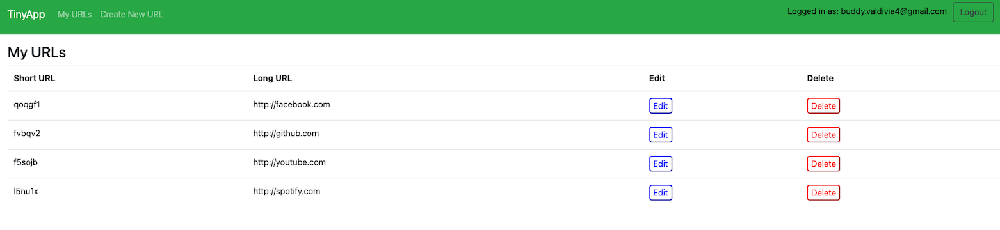
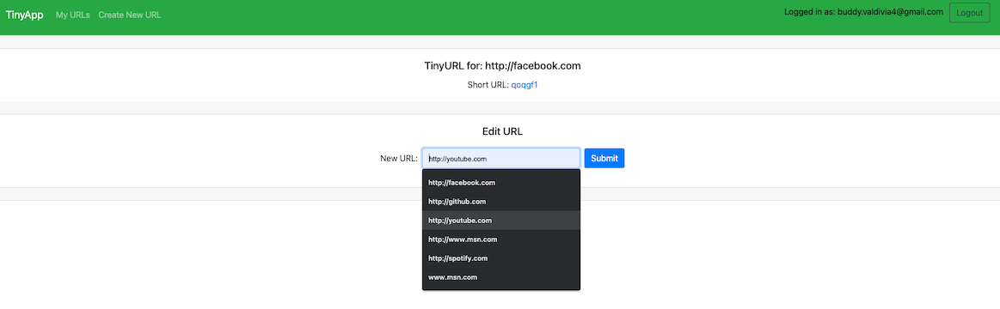

# Welcome to my TinyApp Project

<p align="center">
  
</p>

# 
TinyApp is a full stack web application built with Node and Express that allows users to shorten long URLs (à la bit.ly).


## Final Product

### Main URL Page after you login
- This shows all the shortened URL that the user created
- On this page, you can edit and delete the shortened URL 


#
### Edit Window
- The edit window will show the long URL and the shortened URL. By clicking on the short URL, it will redirect you to the URL you want to be shortened.
- You can also edit the long URL and assign it to a new URL.



## Dependencies
#### We have used the following core dependencies.
- [Node.js](https://nodejs.org/en/)
- [Express](https://expressjs.com/)
- [EJS](https://ejs.co/)
- [bcrypt](https://www.npmjs.com/package/bcrypt)
- [body-parser](https://www.npmjs.com/package/body-parser)
- [cookie-session](https://www.npmjs.com/package/cookie-session)

### For unit test, we used Mocha and Chai
- [Mocha](https://www.npmjs.com/package/mocha)
- [Chai](https://www.npmjs.com/package/chai)
## Getting Started

- Install all dependencies (using the `npm install` command).

#### sample (*installing bcrypt dependency*): 
```
npm install bcrypt
```
- Run the development web server using the `node express_server.js` command.